  

  Kanpur, Uttar Pradesh |
  <a href="https://unnayansingh.in">Portfolio</a> |
  <a href="https://www.linkedin.com/in/unnayan-singh-2b9062289/">LinkedIn</a> |
  <a href="mailto:unnayansingh2005@gmail.com">Email</a>

## About

Software developer with a B.Tech in Computer Science (Cyber Security) from PSIT Kanpur, class of 2026. I build full-stack web applications and backend services with Python, JavaScript, React, FastAPI and Flask, backed by PostgreSQL and MySQL. My recent work includes an AI-powered career platform, authentication and password hashing, REST API integration, and testing and debugging across the full stack. I'm looking for a software developer role where I can keep shipping and learning.

## Experience

**QA Intern, Instawork** (Feb 2026 to Aug 2026)
Tested application features and workflows, reported defects, and worked with the team to verify fixes.

**AI Trainer, Outlier** (Jun 2026 to Jul 2026)
Evaluated AI-generated responses against quality criteria and gave structured feedback to improve model output.

**Front-End Web Development Intern, Edunet Foundation** (Aug 2025 to Sep 2025)
Developed responsive web applications, integrated REST APIs, handled JSON data, and collaborated using Git and GitHub with React, JavaScript, HTML, and CSS.

**SDE Intern, Bluestock** (May 2025 to Jun 2025)
Assisted with web application development, backend API integration, testing, debugging, feature implementation, and Git-based collaboration using JavaScript and React.

## Projects

### CareerPilot AI: Career Intelligence Platform
`Python` `FastAPI` `PostgreSQL` `AI`

- Built an AI-powered platform with resume analysis, job matching, skill-gap detection, personalized learning recommendations, and interview preparation.
- Developed the backend with FastAPI and PostgreSQL for authentication, career analytics, and application workflows.
- Added data-driven features and dashboards that turn career and job data into actionable insights.

### NoteShelf: Online Notes Sharing Platform
`Flask` `MySQL` `Tailwind CSS`

- Built a full-stack platform for uploading, browsing, downloading, and managing study materials through an admin workflow.
- Implemented user authentication, secure password hashing, and database-backed content management with Flask and MySQL.
- Designed responsive interfaces with Tailwind CSS.

### HushImage: Secure Image Steganography Application
`Python` `Flask` `Tkinter` `MySQL` | [Repository](https://github.com/UnnayanSingh/HushImage)

- Built web and desktop applications for hiding messages inside images, with message history and database integration.
- Implemented authentication and password hashing, and applied debugging and testing across the frontend, backend, and database.

### More projects
[DoMate](https://github.com/UnnayanSingh/DoMate) (task manager, [live demo](https://unnayansingh.github.io/DoMate)) | [Mental Health Companion](https://github.com/UnnayanSingh/Mental-Health-Companion) (React, Node.js, Gemini API) | [Sales Analytics](https://github.com/UnnayanSingh/Sales-Analytics-Project) (Python, Pandas)

## Skills

| | |
| --- | --- |
| **Languages** | Python, JavaScript, SQL, C++ |
| **Frontend** | React.js, HTML, CSS, Tailwind CSS |
| **Backend** | FastAPI, Flask, Node.js, REST APIs |
| **Databases** | PostgreSQL, MySQL, MongoDB |
| **AI and Data** | Generative AI applications, Pandas, NumPy, Power BI |
| **Tools and Practices** | Git, GitHub, Postman, VS Code, Testing, Debugging, Object-Oriented Programming |

## Education and Certifications

**B.Tech in Computer Science & Engineering (Cyber Security)**, PSIT Kanpur, 2022 to 2026, CGPA 7.57

- Oracle Cloud Infrastructure 2025: Certified Generative AI Professional
- Oracle Cloud Infrastructure 2025: Certified DevOps Professional
- Oracle AI Cloud Database Services 2025: Certified Professional
- 4-star coder in problem solving, HackerRank
